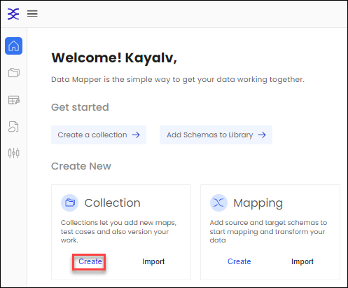
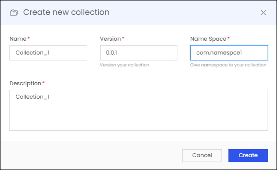
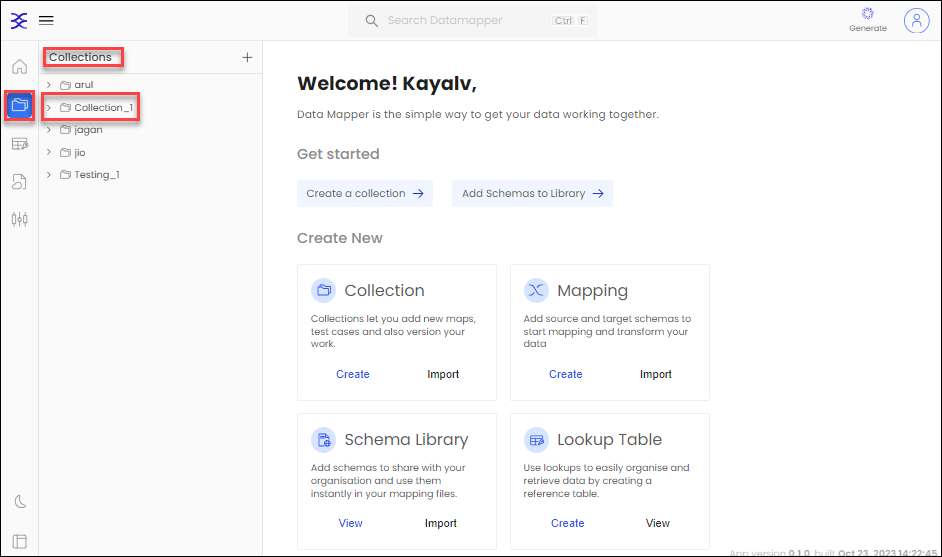

# Collection Management

Within the commanding domain of DataMapper, constructing collections is a task of elegance. Once your Data Collection stands strong, you will possess the unrivaled power to sculpt the fate of your data and data mapping 

## Create the collection

1.  Crafting a collection has never been more straightforward. Journey to the heart of DataMapper and breathe life into your Data Collection by invoking the "Create" button under the "Collection" tab.
   
    

    

    

3.  Within the sacred **Create new collection** tab, inscribe the collection's Name, Version, Name Space, and Description. After endowing these vital details, release the full potential of your collection by activating the **Create** button.

    

    

    

    > **Note**: In the Name, only underscores (_) are permitted, and within the Name Space, you may only utilize dots (.) as special characters.
4.  As the collection emerges from the crucible of creation, it takes its rightful place on the left-hand side, nestled among your esteemed Collections.

    
    
6. You can navigate to your collection and explore its depths. Inside, you will discover that the collection remains pristine, a blank canvas devoid of any mappings.

To embark on your journey of data mastery, simply click on [Data Mapping](Mapping.md). This is where you will uncover the ancient secrets of creating mappings, enabling you to connect the realms of source and target with precision and finesse, all within the realm of DataMapper.
