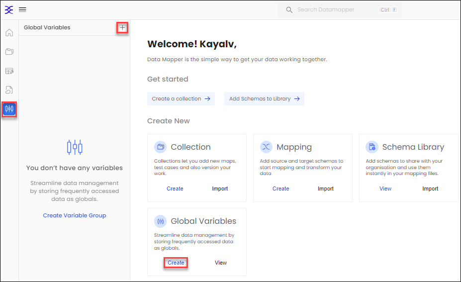
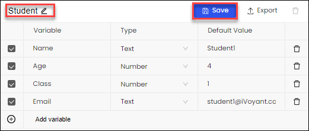
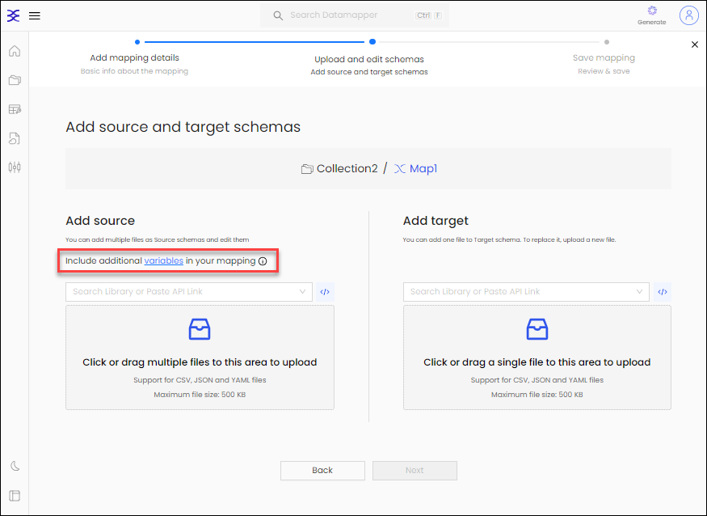
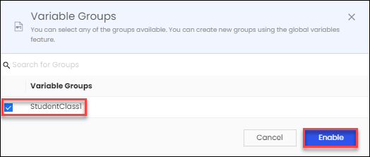
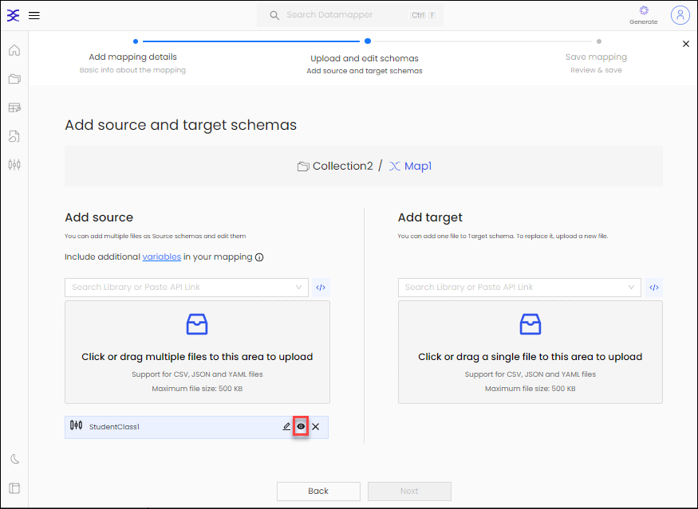

## Introduction
You can also add Global Variables in DataMapper, which can be imported during the mapping process in the source schema from the defined global variables. Using variables makes it easy when the same data key values are required across multiple mappings, simplifying data integration tasks.

## Add Global Variables

1. To create Global Variables, navigate to **Global** in the left-side menu or directly click on **Create** within the Global Variables section.

   

2. Provide a variable group **name** and define your variables, then click **Save**.

   

   > **Supported data types for variables includes String, Number and Boolean.**
   > **Default values are mandatory when adding variables.**
   
3. While adding the Source, incorporate additional **variables** into your **Mapping**.

   

4. Select the **Variable Group** you want to include and then click on **Enable**.

   

5. You can review the imported variables by clicking on the eye icon.

   

That's how you can seamlessly include a **Variable Group** in your mapping process, ensuring consistency and efficiency. For further details, refer to the (Mapping)[Mapping.md] section to explore the process of adding mappings to your Data Collections and leveraging these global variables to streamline your data integration efforts.
