# Mapping

Mapping is the cornerstone of DataMapper, allowing you to seamlessly link source and target data. Here are some standout features of the Mapping module:

* **Versatile Source and Target Handling:** You can effortlessly add multiple sources and targets, enabling unparalleled flexibility.
* **Data Integration Made Simple:** Data can be sourced from API links, and you can directly upload files from your local system.
* **Drag-and-Drop Convenience:** The user-friendly drag-and-drop feature is fully supported, streamlining data manipulation.
* **File Size Limit:** Keep in mind that the maximum allowable file size is capped at 500 KB.
* **Auto Mapping:** For columns with similar names, DataMapper supports automatic mapping, making your life easier.
* **Manual Mapping:** Should you require custom mapping, DataMapper has you covered, providing complete control over your data integration.

## Create Mapping

Mapping creation is a versatile process that can be initiated from various entry points. One common scenario is when you've already created a collection and are exploring its contents. At this point, you'll have the option to create a new mapping. Alternatively, from the home page, you can access the "Mapping" section and initiate the creation process.

Here's a step-by-step guide to creating a mapping:

1. To create a mapping directly from a collection, click on "Create a new mapping" beneath the collection name.

   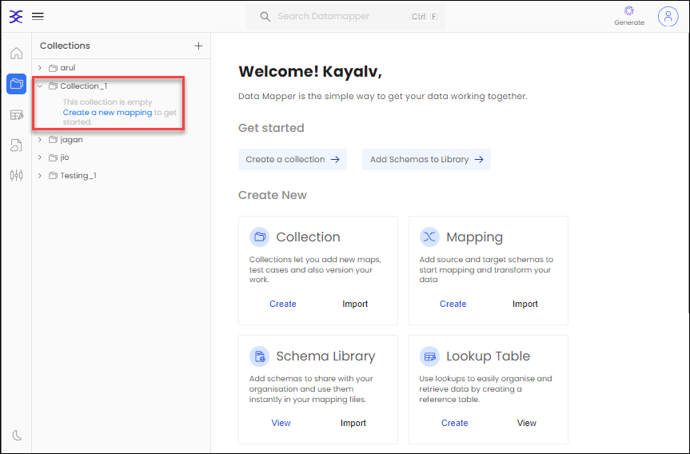

2. In the **Add Mapping Details** tab, select the collection where you wish to add the map. Provide a name for your map in the **Name your map** field, and include a description for this mapping under your selected collection.

3. Click the "Next" button to continue.

   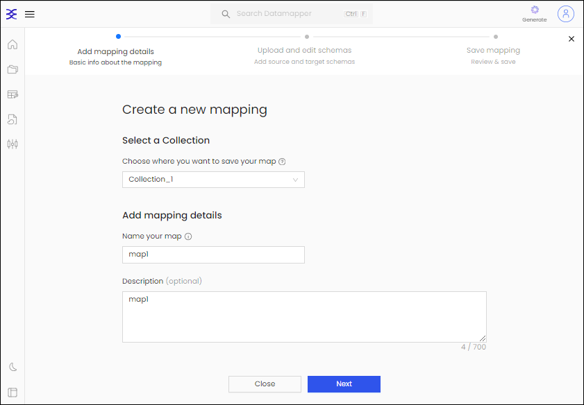

4. Under the **Upload and Edit Schemas** tab, you can add the source and target using any supported method. In this example, we'll upload the schema using an API URL, but you can also achieve this by uploading or drag-and dropping supported file types.

   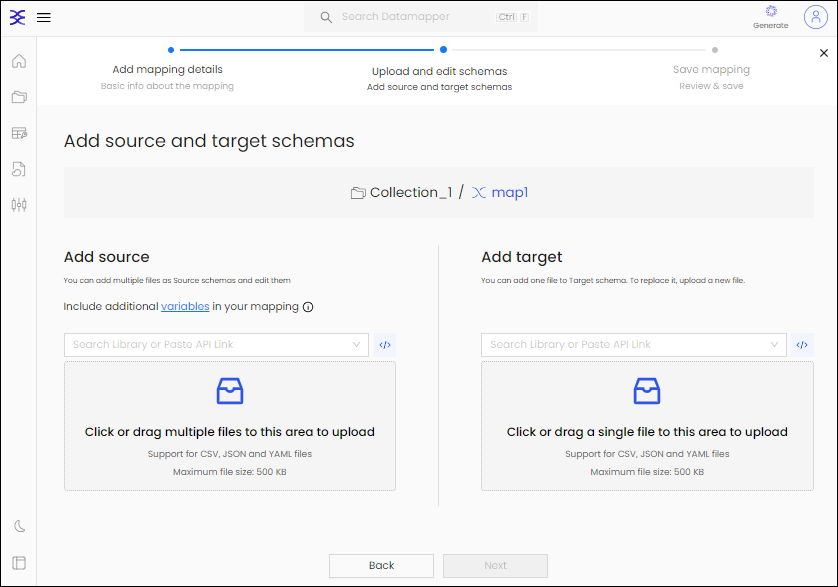
    
5. To add the source, paste the API link from which you want to download the file and then click **Download** from the entered URL.

   <div align="left">

   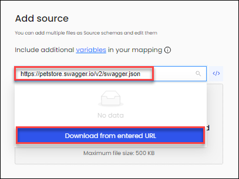

   </div>
    
6. Select the definition you wish to import and then click **Create.**

   <div align="left">

   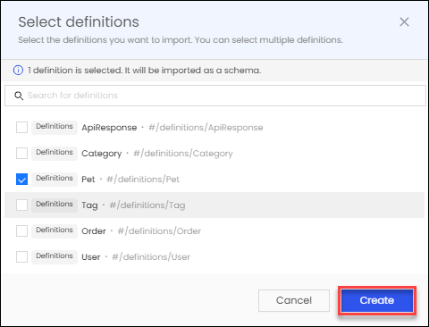

   </div>
7. Similarly, you can add the target, either by providing the target API link or uploading the file from your computer.
    
   <div align="left">

   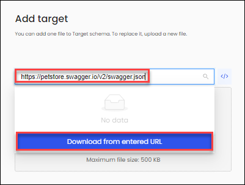

   </div>
    
8. Select the definition you want to import for the target and click **Create.**

   <div align="left">

   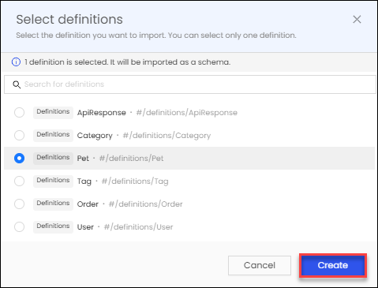

   </div>
9. Once the source and target are added, you can click on the eye icon under source and target to preview the schema.

   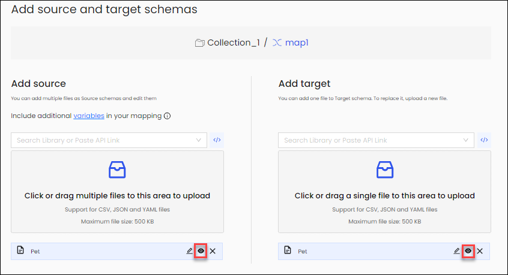

10. After loading the preview schema, you can view the data in a structured manner, including "**Reqd**, **Type**, **Property** and more. You can also edit the schema here.

11. Let's make an example edit: change the **Category** property name to **Cat**, then click **Apply**. You can edit other items, such as descriptions and examples.

    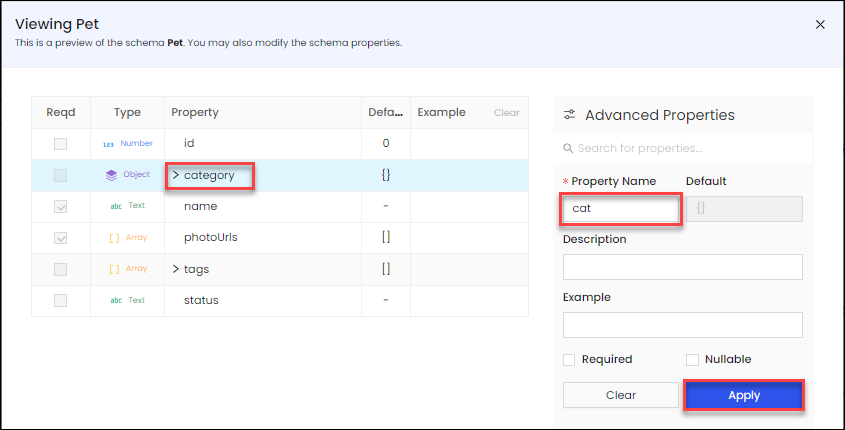
   
12. You can close the **Viewing Pet** screen by clicking on the cross icon in the top left corner.
13. Now, click **Next** to proceed with the source-to-target mapping.

    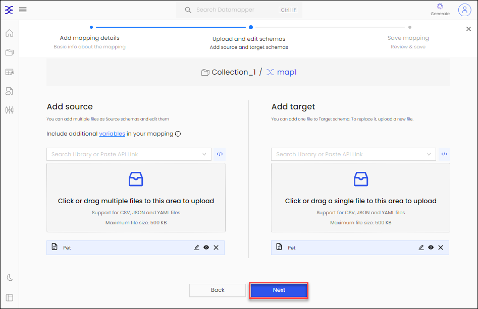
    
14. On the **Save Mapping** window, you have the option to either click **Auto Map & Save** for automatic mapping or select **Preview Mapping** to make manual updates.

    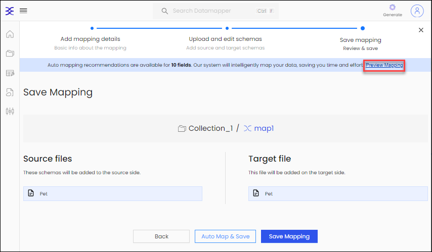
    
15. You can also remove the mapping by clicking on the target object and then selecting **Remove All Mapping** from the ellipsis menu.
16. Once you've completed the mapping, click **Apply and Save Mapping**.

    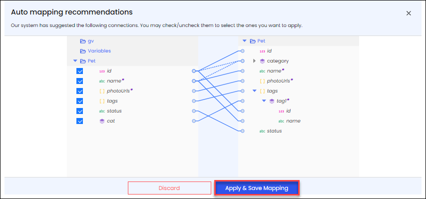
    
17. Finally, click **Save Mapping**.

    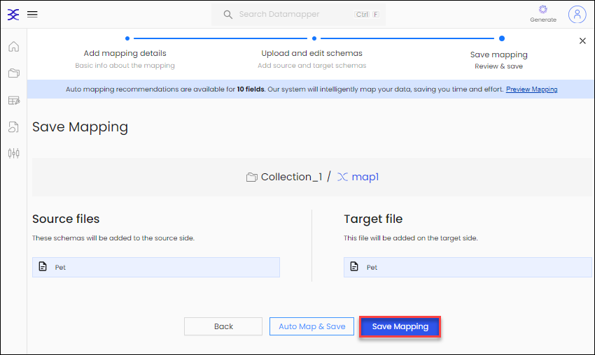
    
18. To enhance convenience further, you can generate code using the **Code Generator**. Supported programming languages include Java (Experimental), JavaScript (Experimental), C#, Java, and JavaScript. Simply click on the "Generate Code" icon, then select your preferred programming language. Once the code is generated, you can copy it or download it for your use.

    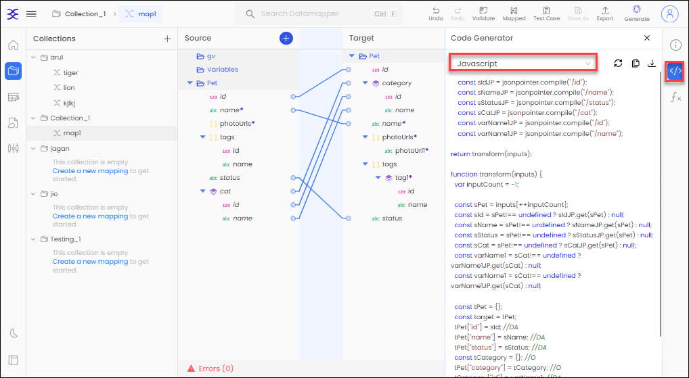

## Functions

Functions are a powerful tool in DataMapper mapping, making the process of mapping data from multiple sources to the target a breeze. Mapping expressions can harness these functions to manipulate your data effectively.

Let's delve into an example of how functions can be employed:

1. First, add another source. Paste the API link from which you want to download the file and then click **Download from the entered URL**.

   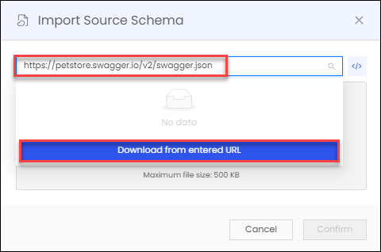

2. Select the definition you want to import and then click **Create**.

   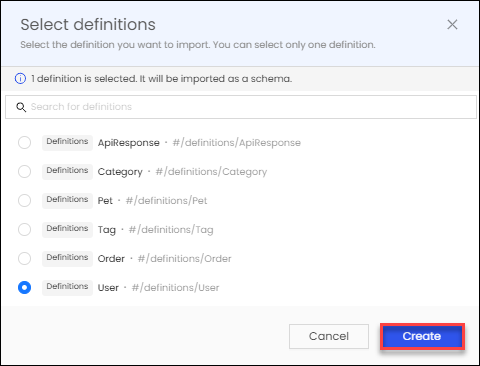

3. On **Import Source Schema** tab, review the schema and click **Confirm**.

   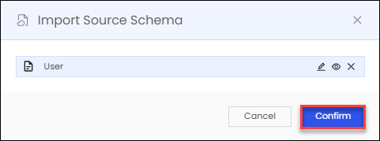

4. Let's say you want to map the **firstName** and **lastName** from the source **User** to the **Name** in the target **Pet**. To achieve this, you can use the **concat** function in Mapping Expressions:

   ```
   concat($.User.firstName,$.User.lastName)
   ```
   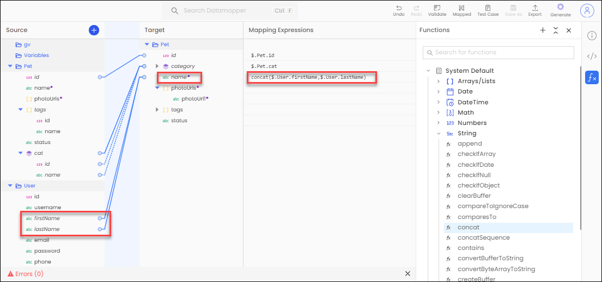

Likewise, you can harness the capabilities of these functions to effortlessly manipulate your data mappings, making tasks such as merging, transforming, and validating data a seamless part of your data integration process.


   
 


