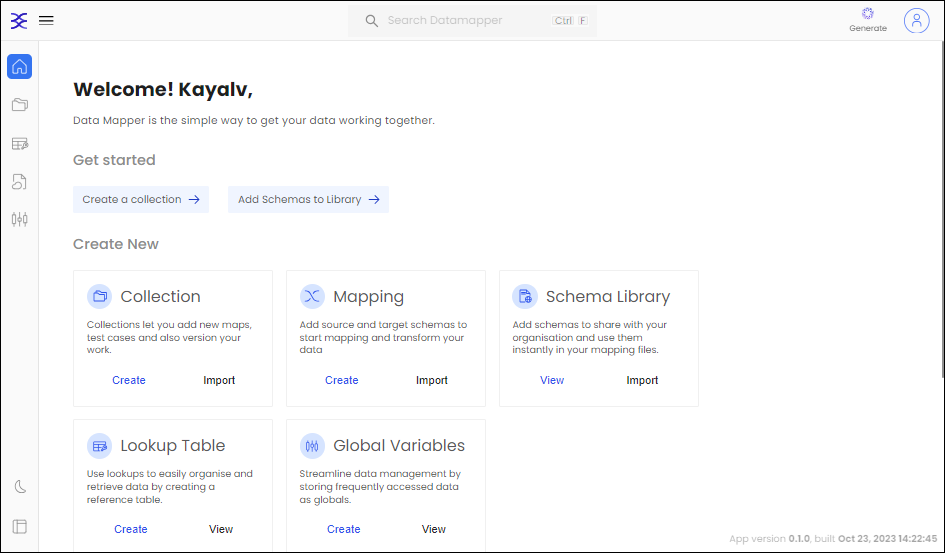

# Introduction

Behold the DataMapper, your ultimate gateway to data transcendence. This powerhouse offers a relentless approach to flawlessly synchronize your data, boasting an intuitive, visually stunning mapping interface that grants you the power to conquer data integration without the burden of a formidable learning curve. With DataMapper, you can effortlessly conjure collections, perform unyielding mapping, and construct a veritable Schema Library.

  

## Key Features:

* [Collection Management](./Collection.md):  Effortlessly create, peruse, and meticulously organize your data collections. Whether you're wrangling customer records, cataloging inventory data, or grappling with any other form of information, DataMapper simplifies it all with unmatched elegance.
* [Mapping](./Mapping.md): DataMapper turns the labyrinthine task of data mapping into a walk in the park. After assembling your data collection, the power to define data mapping is at your fingertips.
* Lookup Tables: Forge and behold lookup tables that enhance data precision and turbocharge data retrieval efficiency.
  
  

DataMapper bestows upon you the scepter of data dominion through an interface that marries intuition and omnipotence. Bid adieu to the muddled labyrinth of data management and embrace an era of data-handling that is not only efficient but also ruthlessly effective. Let DataMapper elevate your data management prowess to unprecedented heights!

Are you ready to embark on a journey into the new frontiers of data management? Seize the moment and embark on your data odyssey with DataMapper today, and witness the untapped potential of your data unfurl before your eyes.
