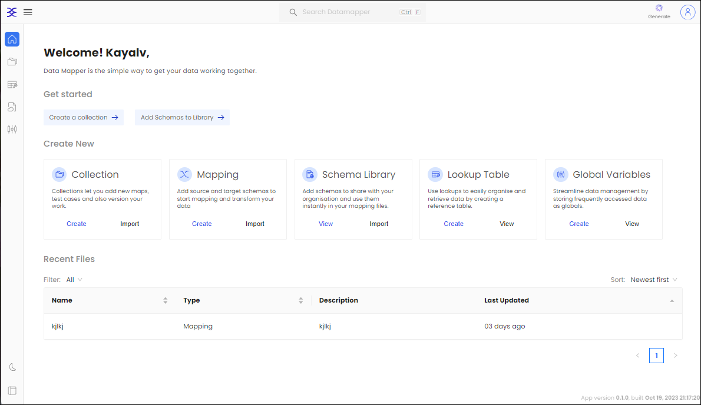

# Introduction

DataMapper offers a straightforward approach to seamlessly harmonize your data, providing a user-friendly visual mapping interface that empowers you to achieve efficient data integration without the need for a steep learning curve. With the capabilities of DataMapper, you can effortlessly generate collections, perform robust mapping, and establish a Schema Library.

## Key Features:

* [Collection Management](./Collection.md): Create, view, and organize your data collections effortlessly. Whether you're dealing with customer records, inventory data, or any other form of information, Datamapper makes it easy.
* [Mapping and Schema Definition](./Mapping.md): DataMapper makes the data mapping easy. After creating the data collection you can define the data mapping into that. Data
* Lookup Tables: Create and view lookup tables to enhance data accuracy and improve data retrieval efficiency.

  

Datamapper empowers you to take control of your data with an intuitive and powerful interface. Say goodbye to data management complexities and hello to efficient and effective data handling. Elevate your data management game with Datamapper!

Ready to experience a new era of data management? Start using Datamapper today and unlock the potential of your data.
