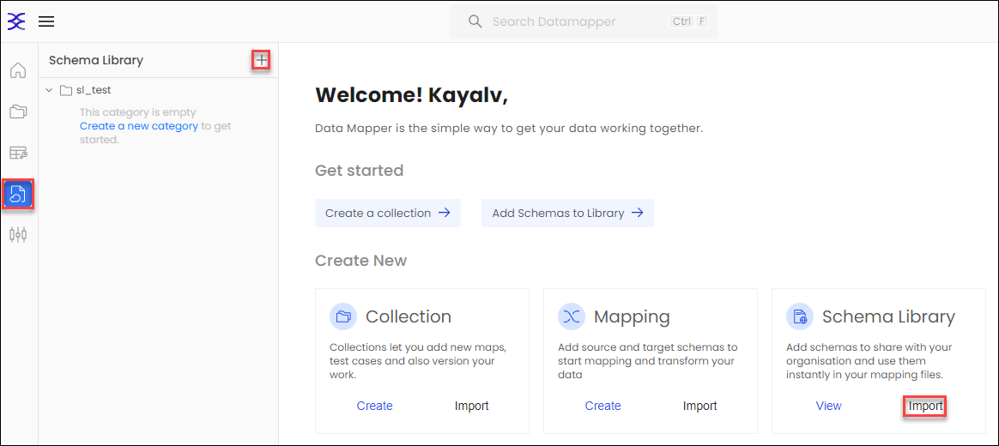
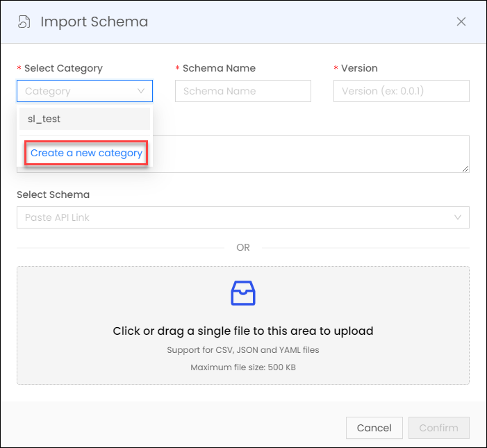
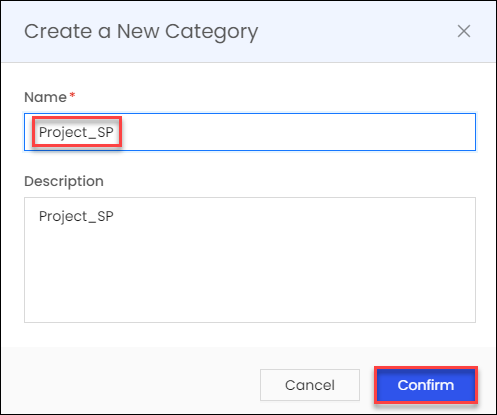
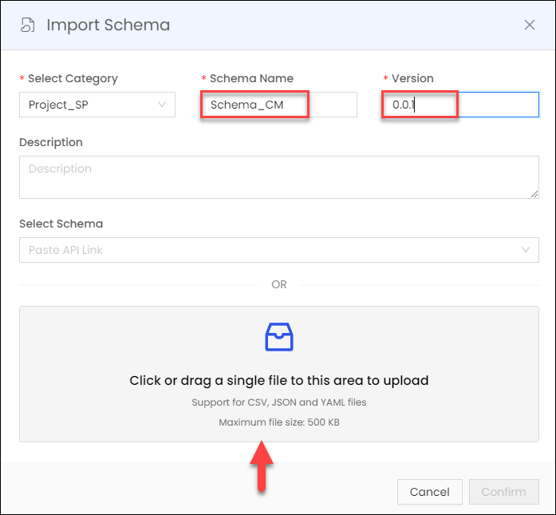
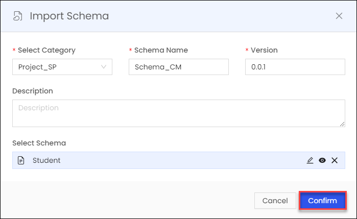
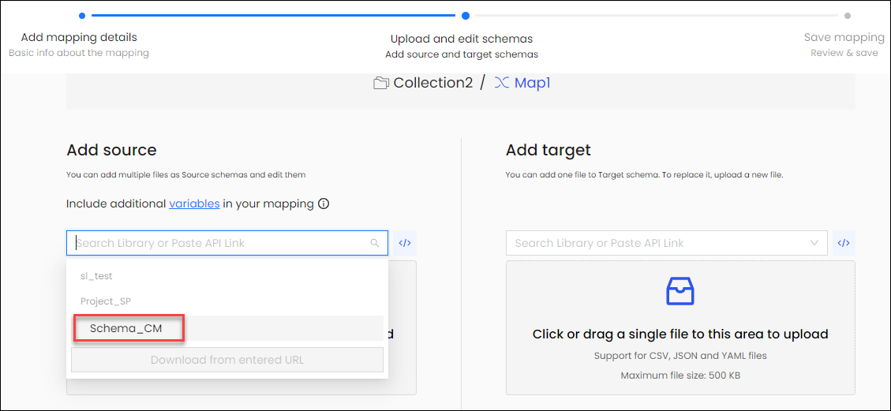
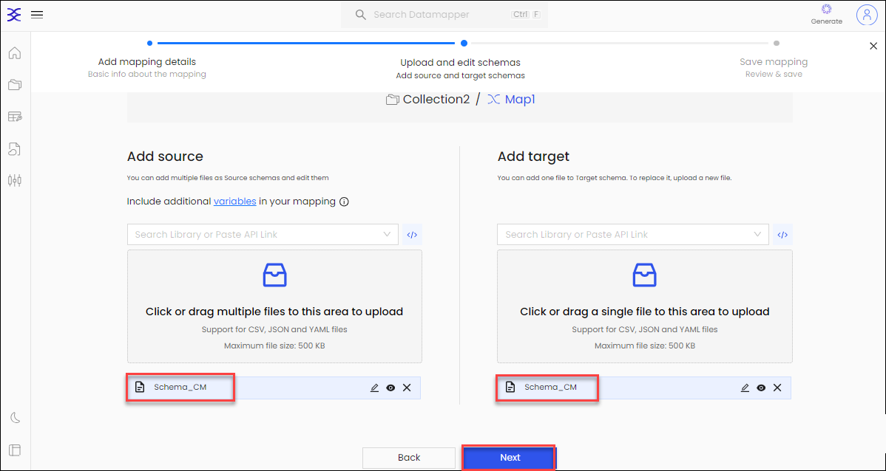
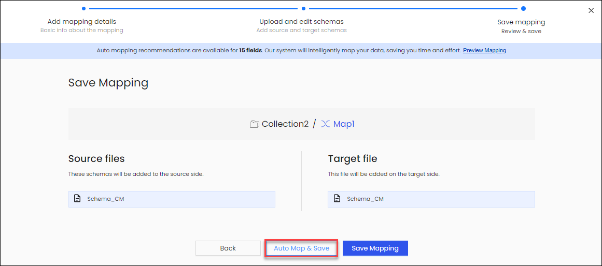
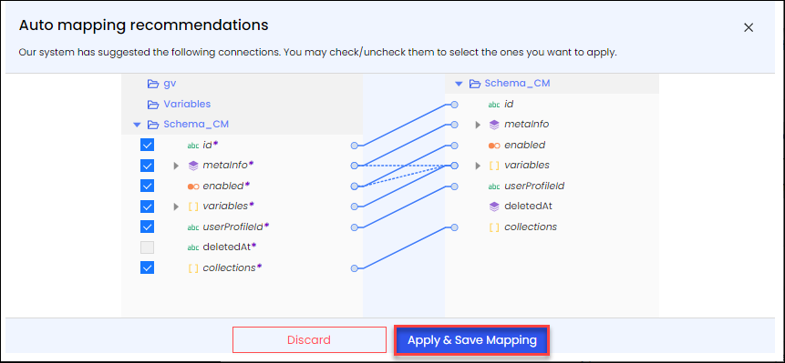

## Schema Library
Store schemas in a shared space for easy access and collaboration. Eliminate manual schema selection; instantly access shared schemas for seamless integration into mapping files. Streamline processes by centralizing and sharing schemas within the organization.he process of mapping source and target data.

### The Art of Schema Import

1.  To embark on this journey, navigate to the majestic **Library** and unveil your aspirations by clicking the regal plus icon in the left-side menu. Alternatively, for a direct entrance, grace the home page with your presence and click on **Import** within the Schema Library section.

    
2.  Under the grand banner of **Import Schema**, you wield the power to select from existing categories or, should your vision demand it, you can craft a new category by clicking **Create a new category**. The choice is yours, and it's a choice of paramount importance.

    

    

    

3.  For new category creation, etch your intentions by inscribing the **Name** in the hallowed scroll of **Create a New Category**, embellish your vision with a **description**, and then, with resolute purpose, seal your creation by clicking **Confirm**.

    

    

    

4.  Now, the moment of reckoning has arrived. As the architect of data, you must decree the **Schema Name** and decree the **Version** with unwavering conviction. Inscribe your intentions and summon forth the **Schema file**, be it through an upload of your choosing or through the summoning of an **API link**.

    

    

    

5.  As the **Schema** file materializes before you, with a flourish, click **Confirm**, sealing the covenant between your ambition and the raw potential of your data.

    

    

    

6.  In the majestic **Library**, behold the newly minted **Schema Category**, a testament to your prowess in shaping the data landscape.

    

    

    

7.  Now, harness the might of the Schema Library as you seamlessly infuse it into your mapping **source** and **target**. The bridge between your data aspirations and reality is formed.

    

    

    

8.  With the source and target schemas gracefully in place, you stand at the precipice of a grand mapping endeavor. Cross over with a simple click on **Next**.

    

    

    

9.  Click on **Auto Map & Save** for auto mapping.

    

    

    

10. As the grand symphony of mapping is reviewed and perfected, you hold the power to seal it in greatness by decreeing, with all the weight of your ambition, **Apply & Save Mapping**.

This is the saga of how you can masterfully create and wield the Schema Library, your key to effortless mapping of commonly used schemas. To further your enlightenment, journey to the [Mapping](Mapping.md) section, where the intricacies of adding mappings await your noble exploration.
